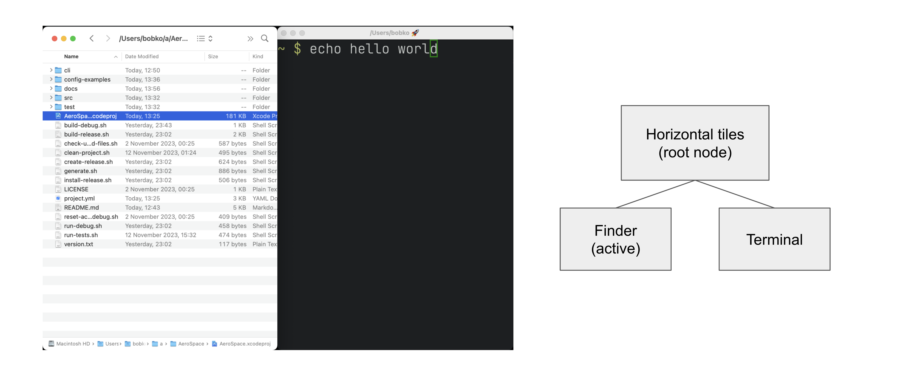
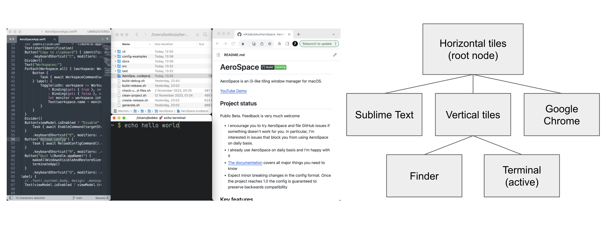
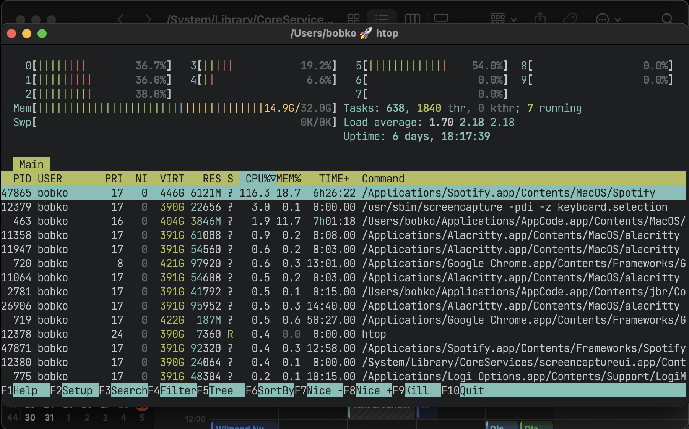
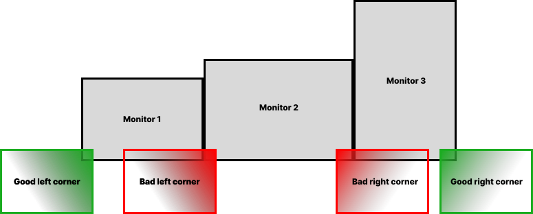

= AeroSpork Guide
include::util/site-attributes.adoc[]
:url-search-for-config: https://github.com/search?q=path%3A*aerospork.toml&type=code

include::util/header.adoc[]

This guide is written to be read from top to bottom.
Skip what you already know.

[#installation]
== Installation

[#manual-installation]
=== Manual installation

AeroSpork needs macOS 13 or later, on Apple silicon or Intel.

. Download the latest available zip from https://github.com/wbsmolen/aerospork/releases[releases page]
. Unpack zip
. Put unpacked `aerospork-v$VERSION/AeroSpork.app` to `/Applications`
. Symlink the CLI onto `$PATH`
(optional; needed only to drive AeroSpork from the CLI):
`ln -s /Applications/AeroSpork.app/Contents/MacOS/aerospork-cli /usr/local/bin/aerospork`

NOTE: The zip's `bin/aerospork` is itself a relative symlink into the bundle — that is what keeps
the CLI covered by the app's notarization ticket — so copying it out of the unpacked folder leaves
a link that points at nothing. Symlink the installed app's copy instead, as above.

[#homebrew-installation]
=== Homebrew installation

[source,bash]
----
brew install --cask wbsmolen/tap/aerospork
----

The cask installs the app, links the bundled CLI onto your `PATH`, and installs the man pages and
the bash, fish and zsh completions. Your shell may need configuring to pick up Homebrew's
completions: https://docs.brew.sh/Shell-Completion

NOTE: The release zip carries the same completions under
`aerospork-v$VERSION/shell-completion/`.

Releases are signed with a Developer ID, notarized by Apple and stapled, so Gatekeeper accepts
them on first launch and you should not see a warning.

If you do see

----
"AeroSpork.app" can't be opened because Apple cannot check it for malicious software.
----

then the copy you have is not one of those -- a build from source, or a download that was altered in
transit. Prefer replacing it with a release from the
https://github.com/wbsmolen/aerospork/releases[releases page] over dismissing the warning: right
click the app in Finder and choose Open to run it anyway, which is a decision to trust that
particular copy.

[#configuring-aerospork]
== Configuring AeroSpork

[#config-location]
=== Custom config location

AeroSpork looks for a custom config in two locations:

. `~/.aerospork.toml`
. `+${XDG_CONFIG_HOME}/aerospork/aerospork.toml+`
(`XDG_CONFIG_HOME` falls back to `~/.config` when the variable is not set)

If a config is found in more than one location, the ambiguity is reported.

Debug builds read `~/.aerospork-debug.toml` /
`+${XDG_CONFIG_HOME}/aerospork/aerospork-debug.toml+` instead, so a debug build never touches the
config your installed copy runs. Starting the app with `--config-path <file>` overrides both
locations and skips the ambiguity check entirely.

=== Config samples

* <<default-config,The default config>>
* xref:./goodies.adoc#i3-like-config[i3-like config]
* {url-search-for-config}[Configs written by other users on GitHub]

The config format is TOML, which supports comments.
See the https://toml.io/en/v1.0.0[TOML spec].

[#default-config]
=== Default config

The default config is part of this documentation.
It carries the everyday configuration keys, annotated with comments.
The options it does not cover are described further down this guide.
If no custom config is found, AeroSpork loads the default config.

IMPORTANT: Once you have your own config file, `default-config.toml` is *not* consulted at all.
A key you omit falls back to AeroSpork's **built-in** default, which is not always the value
`default-config.toml` demonstrates. The two differ where it is most likely to surprise you:

[cols="2,1,1"]
|===
|Key |Built-in default (what you get if you omit it) |`default-config.toml` shows

|`gaps` |`0` on every edge |`inner = 8`, `outer = 8`
|`mod` |unset: **no bindings are generated at all** |`alt`
|`workspaces` |unset: no per-workspace bindings and no declared workspaces |`1-9`
|`keys` / `mode.*.binding` |empty |a service mode
|===

(`monitors` and `on-window` are empty in both — the default config shows examples of each, but
commented out.)

The remaining built-in defaults are `accordion-padding = 30`,
`default-root-container-layout = 'tiles'`, `default-root-container-orientation = 'auto'` and
`start-at-login = false` (all four shown, commented out, in `default-config.toml`), plus six the
default config does not mention at all: `enable-normalization-flatten-containers = true`,
`enable-normalization-opposite-orientation-for-nested-containers = true`,
`auto-move-workspaces-on-monitor-connect = true`,
`automatically-unhide-macos-hidden-apps = false`, `show-menu-bar-icon = true` and
`show-dock-icon = false`. `after-startup-command`, `on-focus-changed`,
`on-focused-workspace-changed`, `on-focused-monitor-changed`, `on-window-detected`,
`persistent-workspaces` and `workspace-to-monitor-force-assignment` default to empty; the `exec` table defaults as described
under <<exec-env-vars>>.

The safe way to start is therefore to copy the default config and edit it, rather than to write a
short file and assume the rest is inherited:

[source,shell]
----
cp /Applications/AeroSpork.app/Contents/Resources/default-config.toml ~/.aerospork.toml
----

link:config-examples/default-config.toml[Download default-config.toml]

[source,toml,subs="macros+,specialchars+"]
----
include::config-examples/default-config.toml[]
----

[#config-v2]
=== The v2 schema, and how older configs get there

The default config above is written in the current (v2) schema: `mod` and `workspaces` generate
the i3-style bindings, `[keys]` holds only what you add or override, and the assignment and rule
sections are spelled `[monitors]` and `[on-window]`. A v1 config (everything spelled out under
`[mode.main.binding]`, `workspace-to-monitor-force-assignment`, `[[on-window-detected]]`) still
loads — and the first time it does, AeroSpork rewrites it to v2 in place, keeping your original
next to it as `<name>.pre-v2`. The migration only happens when the converted file provably parses
to the same configuration, and it is skipped forever once a `.pre-v2` file exists — so going back
to v1 sticks. One consequence to know in advance: the rewrite regenerates the file, so comments
and formatting from the original survive only in the `.pre-v2` copy.

How the v2 pieces layer:

* `mod = 'alt'` generates the i3 defaults (focus, move, resize, layout, workspace-back-and-forth,
  and friends), and `workspaces = [ '1-9', 'A', 'chat' ]` generates two bindings per workspace —
  switch and move-node. A token is a range only when it is exactly `<char>-<char>`, so
  `my-workspace` stays a literal name.
* Every workspace in `workspaces` also always exists, even while empty, whether or not `mod` is set.
  See <<persistent-workspaces>>.
* `[keys]` (and `[keys.<mode>]` for other modes) layers on top of the generated set; a key you
  write there wins. `[mode.*.binding]` still layers on top of both.
* Because each workspace's binding comes from its name's first character, two workspaces sharing a
  first character (`workspaces = ['dev', 'docs']`) is an error — the same key would be generated
  twice — and a name whose first character has no key on the keyboard (for example a non-Latin
  script) cannot generate a binding and is rejected too. Rename, or bind those workspaces yourself
  in `[keys]`.

xref:commands.adoc#config[`aerospork config`'s manual] documents the same schema from the
command's point of view.

[#persistent-workspaces]
=== Which workspaces exist

A workspace the config *declares* always exists, even while it is empty and on no monitor:

* every name in `workspaces`,
* every name in `persistent-workspaces` (AeroSpace's spelling), a list of names or ranges such as
  `persistent-workspaces = ["1-9", "chat"]`, which declares without generating any binding,
* every workspace pinned to a monitor under `[monitors]` or `workspace-to-monitor-force-assignment`.

A reserved name that no command could switch to, such as `next`, is an error.

So `aerospork list-workspaces --all`, the menu bar and `workspace next`/`prev` list all of them from
the moment AeroSpork starts. Any other workspace, such as one you reach only through a binding of your own
like `alt-0 = 'workspace 10'`, is created when you switch to it and released once it is empty and
not visible.

A declared workspace that has never been shown belongs to the main monitor, so with several monitors
`workspace next`/`prev` cycle it there until you first switch to it somewhere else. After that it
keeps the monitor it was last on. Across a restart, an empty one comes back on the main monitor.

[#coming-from-aerospace]
=== Coming from AeroSpace

AeroSpork reads `~/.aerospork.toml` or `~/.config/aerospork/aerospork.toml`, never AeroSpace's
`~/.aerospace.toml` or `~/.config/aerospace/aerospace.toml`. With only an AeroSpace file present,
AeroSpork runs its default config and says
so on stderr and in the `config` log. Copy the file across, then:

* `AEROSPACE_*` environment variables are never set. The names are `AEROSPORK_FOCUSED_WORKSPACE`,
  `AEROSPORK_PREV_WORKSPACE`, `AEROSPORK_WINDOW_ID` and `AEROSPORK_WORKSPACE`, and the CLI is
  `aerospork`. A config line that still says `AEROSPACE_` or runs `aerospace` loads, with a warning
  naming the line.
* `config-version`, `auto-reload-config`, `on-mode-changed` and `focus-follows-mouse` have no AeroSpork
  equivalent. They are reported and ignored rather than rejecting the file; a saved config always
  reloads by itself.
* `persistent-workspaces` works as it does in AeroSpace, and so does `workspaces`. See
  <<persistent-workspaces>>.
* In `[[on-window-detected]]`, write the table form of `if` (`if.app-id = '...'`). AeroSpace's newer
  string form, `if = 'test %{...}'`, is rejected with an error that names the replacement. A rule can run only
  `layout floating`, `layout tiling` and `move-node-to-workspace`, and `if.during-aerospace-startup` is
  spelled `if.during-aerospork-startup`.
* The first time a v1-style config (bindings under `[mode.main.binding]`) loads, AeroSpork rewrites it
  to v2 and keeps the original as `<name>.pre-v2`. See <<config-v2>>.

[#key-notation]
=== Key notation

A binding key is modifiers joined to one key with `-`: `alt-shift-h`. The four modifiers are
`shift`, `ctrl`, `alt` and `cmd`. Keys are named:

* Letters `a`–`z` and digits `0`–`9`
* `f1`–`f20`, arrows `left`/`down`/`up`/`right`
* `minus`, `equal`, `period`, `comma`, `slash`, `backslash`, `quote`, `semicolon`, `backtick`,
  `leftSquareBracket`, `rightSquareBracket`, `space`, `enter`, `esc`, `backspace`, `tab`,
  `pageUp`, `pageDown`, `home`, `end`, `forwardDelete`, `sectionSign` (ISO keyboards)
* Keypad: `keypad0`–`keypad9`, `keypadClear`, `keypadDecimalMark`, `keypadDivide`, `keypadEnter`,
  `keypadEqual`, `keypadMinus`, `keypadMultiply`, `keypadPlus`

[#gaps]
=== Gaps

`[gaps]` puts space between windows (`inner`) and between windows and the screen edge (`outer`):

[source,toml]
----
[gaps]
inner = 8              # both axes at once…
outer = 8              # …or per direction:
# inner.horizontal = 8
# inner.vertical = 8
# outer.top = 8
# outer.bottom = 8
# outer.left = 8
# outer.right = 8
----

Any of the six per-direction values can also differ per monitor. The value becomes an array: one
or more `{ monitor.<pattern> = <gap> }` rules tried in order, and the array's last element is the
plain number used when nothing matches — it is required:

[source,toml]
----
outer.top = [{ monitor.'built-in' = 3 }, { monitor.main = 16 }, 24]
----

`<pattern>` accepts the same monitor descriptions as <<assign-workspaces-to-monitors,workspace
assignments>>. The settings GUI edits flat numbers only; it warns before an edit would replace
per-monitor rules, which stay a Raw TOML affair.

[#binding-modes]
=== Binding modes

A binding mode is a named set of bindings.
Switching to a mode deactivates every binding of the current mode and activates only the bindings of
the new one.
AeroSpork starts in the mode named "main".

The feature is identical to https://i3wm.org/docs/userguide.html#binding_modes[the one in i3].

A mode takes two parts: a binding that switches to it, and the declaration of the mode itself.

[source,toml]
----
[mode.main.binding]            # Declare 'main' binding mode
    alt-r = 'mode resize'      # 1. Define a binding to switch to 'resize' mode

[mode.resize.binding]          # 2. Declare 'resize' binding mode
    minus = 'resize smart -50'
    equal = 'resize smart +50'
----

[#commands]
=== Commands

Commands manipulate AeroSpork and query its state.

You can use them in two ways:

. Bind keys to run AeroSpork commands. Example:
+
[source,toml]
----
[mode.main.binding]
    # Bind alt-1 key to switch to workspace 1
    alt-1 = 'workspace 1'
    # Or bind a sequence of commands
    alt-shift-1 = ['move-node-to-workspace 1', 'workspace 1']
----
. Run commands from the CLI:
+
[source,bash]
----
aerospork workspace 1
----

For the list of available commands see: xref:commands.adoc[]

[#key-mapping]
=== Keyboard layouts and key mapping

By default, key bindings in the config are interpreted as the `qwerty` layout.

If you use a different layout or alphabet, or want an alias for an existing key, use
`key-mapping.key-notation-to-key-code`.

[source,toml]
----
# Define my fancy unicorn key notation
[key-mapping.key-notation-to-key-code]
    unicorn = 'u'

[mode.main.binding]
    alt-unicorn = 'workspace wonderland' # (⁀ᗢ⁀)
----

* `dvorak` and `colemak` have presets.
+
[source,toml]
----
[key-mapping]
    preset = 'dvorak'  # or 'colemak'
----

[#exec-env-vars]
=== exec-* environment variables

The `exec` section configures the environment of `exec-*` commands and callbacks (such as xref:commands.adoc#exec-and-forget[exec-and-forget], <<exec-on-workspace-change-callback>>)

* `exec.inherit-env-vars` controls whether `AeroSpork.app`'s own environment is inherited. The default is `true`
* Override individual variables like this:
+
[source,toml]
----
[exec.env-vars]
    PATH = '${HOME}/bin:${PATH}'
----
+
Environment variable substitution is supported in the form `+${ENV_VAR}+`
* Inspect the resulting environment with xref:commands.adoc#list-exec-env-vars[`list-exec-env-vars`]
* AeroSpork additionally exports, when the command has a target:
+
--
** `AEROSPORK_WINDOW_ID` - the window the command was resolved against
** `AEROSPORK_WORKSPACE` - the workspace the command was resolved against, when it targets an empty
   workspace rather than a window
--
* Commands run by `on-focused-workspace-changed` also get `AEROSPORK_FOCUSED_WORKSPACE` and
  `AEROSPORK_PREV_WORKSPACE`, exactly as <<exec-on-workspace-change-callback>> does. Before 1.2.0
  they were unset there.
* NOTE: `exec-and-forget` runs your command with AeroSpork's **full** environment by default,
including any secrets in it. That is deliberate: a callback that posts to Slack needs its token. But
it means a config snippet copied from the internet runs with everything your shell has. Set
`exec.inherit-env-vars = false` and list what you need under `[exec.env-vars]` if that is not what
you want.
* GUI apps on macOS don’t have Homebrew’s prefix in their `PATH` by default (https://docs.brew.sh/FAQ#my-mac-apps-dont-find-homebrew-utilities[docs.brew.sh]).
So unless your config overrides the `exec` section, AeroSpork falls back to:
+
[source,toml]
----
[exec]
    inherit-env-vars = true
[exec.env-vars]
    PATH = '/opt/homebrew/bin:/opt/homebrew/sbin:${PATH}'
----

[#settings-gui]
=== The settings GUI

xref:commands.adoc#open-settings[`aerospork open-settings`] (or the menu-bar icon, or opening
AeroSpork again while it runs) opens a native settings window with seven panes: General, Gaps,
Keys, Monitors, Events, Window Rules and Raw TOML. The window comes to the front, and AeroSpork
never tiles it or moves it to a workspace. Structured controls apply live, a moment after you stop
changing them. There is no Save button, and a change still pending when you close the window is
saved. A save rewrites only the sections you actually edited, so your comments and
formatting survive, and a saved change takes effect on screen immediately. Raw TOML is the exception: it applies only when you click Apply, since
half-typed TOML is invalid most of the time, and it is the guarantee that no config key is out of
the GUI's reach.

Every GUI save first drops a timestamped backup next to your config
(`<config>.toml.<yyyyMMdd-HHmmss>.backup`; the five most recent are kept), and the Raw TOML pane's
Restore menu lists them. A few config shapes the structured panes cannot rewrite safely — Windows
line endings, dotted or inline spellings of a managed section, multi-line arrays — are refused
with a pointer to Raw TOML rather than degraded, and values richer than a pane's controls (a
hardware fingerprint, a monitor fallback list) are marked `complex` and preserved untouched by
every save.

One related consequence worth knowing: `show-menu-bar-icon = false` together with
`show-dock-icon = false` does not hide both. With no menu-bar icon the Dock icon is forced back
on, so something visible always leads back into Settings. Opening AeroSpork again, or
`aerospork open-settings`, opens Settings too.

[#tree]
== Tree

AeroSpork stores all windows and containers in a tree.
AeroSpork tree tiling model is https://i3wm.org/docs/userguide.html#tree[inspired by i3].

*Definition.* Each non-leaf node is called a "Container"

WARNING: i3 has a different terminology.
"container" in i3 is the same as "node" in AeroSpork.

* Each workspace contains its own single root node
* Each container can contain arbitrary number of children nodes
* Windows are the only possible leaf nodes. Windows contain zero children nodes
* Every container has two properties:
. <<layouts,Layout>> (Possible values: `tiles`, `accordion`)
. Orientation (Possible values: `horizontal`, `vertical`)

"Layout of the window" means the layout of the window’s parent container.

The model is easiest to follow from examples.

.Simple tree structure. Two windows side-by-side

.Complex tree structure

You can nest containers as deeply as you want to.

You can navigate in the tree in 4 possible cardinal directions (left, down, up, right).
You use xref:commands.adoc#focus[focus command] to do that.

The tree structure can be changed with three commands:

. xref:commands.adoc#move[move]
. xref:commands.adoc#join-with[join-with]
. xref:commands.adoc#split[split] (kept for i3 compatibility; prefer `join-with`)

[#layouts]
=== Layouts

AeroSpork has four layouts:

- `h_tiles` horizontal tiles (in i3, it’s called "horizontal split")
- `v_tiles` vertical tiles (in i3, it’s called "vertical split")
- `h_accordion` horizontal accordion (analog of i3’s "tabbed layout")
- `v_accordion` vertical accordion (analog of i3’s "stacked layout")

The `tiles` layout is the one shown in <<tree,the previous section>>.

Accordion is a layout where windows are placed on top of each other.

* *The horizontal accordion* shows left and right paddings to visually indicate the presence of other windows in those directions.
* *The vertical accordion* shows top and bottom paddings to visually indicate the presence of other windows in those directions.

.Horizontal accordion
image::assets/h_accordion.png[,800,align="center"]

.Vertical accordion

As in a `tiles` layout, you navigate an accordion with the xref:commands.adoc#focus[focus] command:
`focus (left|right)` in an `h_accordion`, `focus (up|down)` in a `v_accordion`.

Accordion padding is configurable via the `accordion-padding` option.

[#normalization]
=== Normalization

By default, AeroSpork does two types of tree normalizations:

. Containers that have only one child are "flattened".
The root container is an exception, it is allowed to have a single window child.
Configured by `enable-normalization-flatten-containers`
. Containers that nest into each other must have opposite orientations.
Configured by `enable-normalization-opposite-orientation-for-nested-containers`

[.lead]
*Example 1*

According to the first normalization, such layout isn’t possible:

----
h_tiles (root node)
└── v_tiles
    └── window 1
----

it will be immediately transformed into

----
v_tiles (new root node)
└── window 1
----

[.lead]
*Example 2*

According to the second normalization, such layout isn’t possible:

----
h_tiles
├── window 1
└── h_tiles
    ├── window 2
    └── window 3
----

it will be immediately transformed into

----
h_tiles
├── window 1
└── v_tiles
    ├── window 2
    └── window 3
----

Normalizations keep the tree structure readable from how windows are placed on screen.
You can disable them:

[source,toml]
----
enable-normalization-flatten-containers = false
enable-normalization-opposite-orientation-for-nested-containers = false
----

Keep the normalizations enabled unless you have a specific reason not to.

[#floating-windows]
=== Floating windows

Floating windows are not part of the <<tree,tiling tree>>, with one exception: the
xref:commands.adoc#focus[focus] command treats them as if they were.
A floating window's parent container is the smallest tiling container whose area contains the center
of the floating window.

That removes the need for a separate binding to focus floating windows.

[#emulation-of-virtual-workspaces]
== Emulation of virtual workspaces

Native macOS Spaces have several limitations:

* Switching Spaces is animated, and slow
** The animation can’t be disabled. The `Reduce motion` setting only makes it somewhat faster
* The number of Spaces is capped (up to 16 with one monitor)
* Hotkeys can only switch between Spaces. They can’t create, delete or reorder a Space, or move windows between Spaces
* Apple provides no public API for any of those operations

AeroSpork therefore reimplements Spaces and calls them "workspaces".
While a workspace is not active, all of its windows sit outside the visible area of the screen, in
the bottom right or left corner.
Switching back to the workspace (with the xref:commands.adoc#workspace[workspace] command, or `cmd + tab`) returns its windows to the visible area.

On quit, all windows are returned to the visible area of the screen, each centred on the monitor it
was on. `killall AeroSpork` runs the same cleanup, but if AeroSpork is stuck and the cleanup has not
finished after 10 seconds, it exits without it. A crash does not run the cleanup either, because nothing
intercepts a fatal signal. Either way windows can be left off screen; relaunching AeroSpork brings
them back.

[#workspace-memory]
=== Workspaces across a restart

AeroSpork remembers which workspace each window was on and puts it back when it restarts, along with
the monitor that workspace was on.

The memory is keyed on the window id issued by the macOS window server, so it holds for exactly as
long as that server does. Restarting AeroSpork -- an update, a crash, `killall`, or Quit from the
menu bar -- keeps it. Logging out, restarting the Mac, or quitting and relaunching an *application*
does not: those windows are new as far as the system is concerned, and there is no way to recognise
them. AeroSpork does not guess. It falls back to placing a window by where it physically sits, which
is what it did before.

For windows that must land somewhere specific after their app restarts, say so explicitly with
xref:guide.adoc#on-window-detected-callback[on-window-detected] and `if.during-aerospork-startup`.

The state lives in `~/Library/Caches/com.wbs.aerospork/workspace-memory.json` and is readable only
by you. It is disposable: deleting it costs one restart's worth of placement and nothing else.

The name of the active workspace is shown in the menu bar icon.

The intended workflow is to keep a single macOS Space (or one per monitor, if `Displays have separate Spaces` is enabled) and not to interact with macOS Spaces at all.

[NOTE]
====
macOS does not allow a window to be placed entirely outside the visible area.
A 1 pixel vertical line of each "hidden" window stays visible in the bottom right or left corner of
the screen.
That line is also the recovery path: if AeroSpork crashes badly, you can drag those few pixels back
to the center of the screen to unhide a window by hand.

To minimize how visible hidden windows are, put the Dock at the bottom and turn on automatic hiding.
====

[#automatically-unhide-macos-hidden-apps]
=== macOS app hiding (kbd:[cmd+h])

macOS has its own hiding, separate from workspaces: kbd:[cmd+h] hides an app, kbd:[cmd+opt+h] hides
every other app. A hidden app's windows cannot be laid out, so AeroSpork has to decide what a
tiling window manager should do about them.

[source,toml]
----
automatically-unhide-macos-hidden-apps = false  # the default
----

* `false` (default): kbd:[cmd+h] works as macOS intends. The hidden app's windows are moved out of
  the tiling tree into a separate container and the remaining windows re-tile to fill the space.
  They come back where they were when you unhide the app.
* `true`: AeroSpork undoes the hide. As soon as any app is hidden, every app is unhidden again.
  kbd:[cmd+h] on the focused app additionally re-focuses it, so the shortcut becomes a no-op rather
  than making a window vanish. Use this if you keep hiding windows by accident and want the
  workspace, not macOS, to be the only thing that ever makes a window disappear.
+
NOTE: kbd:[cmd+opt+h] ("Hide Others") is deliberately not re-focused, only unhidden.

=== Proper monitor arrangement

AeroSpork needs free space to hide windows in, so arrange your monitors such that *every monitor has
free space in its bottom right or left corner* (`System Settings -> Displays -> Arrange...`).

Otherwise you will see parts of hidden windows on the other monitors.

.Bad monitor arrangement. Monitor 2 doesn't have free space in either of the bottom corners

.Good monitor arrangement. Every monitor has free space in either of the bottom corners
image::./assets/monitor-arrangement-1-good.svg[,,align="center"]

.Bad monitor arrangement. Monitor 1 doesn't have free space in either of the bottom corners
image::./assets/monitor-arrangement-2-bad.svg[,,align="center"]

.Good monitor arrangement. Every monitor has free space in either of the bottom corners
image::./assets/monitor-arrangement-2-good.svg[,,align="center"]

[#a-note-on-mission-control]
=== A note on Mission Control

With many windows parked in the bottom corner of the screen, Mission Control draws windows smaller
than the available space allows.

Enabling `Group windows by application` works around it:
[source,bash]
----
defaults write com.apple.dock expose-group-apps -bool true && killall Dock
----
(or in System Settings: `System Settings -> Desktop & Dock -> Group windows by application`).

[#a-note-on-displays-have-separate-spaces]
=== A note on '`Displays have separate Spaces`'

macOS behaves better with `Displays have separate Spaces` disabled. It is enabled by default.
Reported focus and performance issues with it enabled:

* Wrong window may receive focus in multi monitor setup (bug in Apple API)
* Wrong borderless Alacritty window may receive focus in *single monitor* setup (bug in Apple API)
* Performance issues
* macOS randomly switches focus back

When `Displays have separate Spaces` is enabled, moving a window between monitors also moves it
between Spaces, which the public APIs AeroSpork uses do not handle correctly: those APIs are not
aware that Spaces exist.
The fewer Spaces there are, the fewer of these problems occur.

|===
|    |'`Displays have separate Spaces`' is enabled |'`Displays have separate Spaces`' is disabled

|Is it possible for window to span across several monitors?
|❌ No. macOS limitation
|👍 Yes

|Overall stability and performance
|❌ Weird focus and performance issues may happen (see the list above)
|👍 The public Apple APIs are more stable, which in turn affects AeroSpork's stability

|When the first monitor is in fullscreen
|👍 Second monitor operates independently
|❌ Second monitor is unusable black screen

|macOS status bar ...
|... is displayed on both monitors
|... is displayed only on main monitor
|===

Unless you need macOS native fullscreen in a multi-monitor setup, disable `Displays have separate
Spaces`. Native fullscreen creates a Space of its own, which brings back the problems above.

To disable the setting:
[source,bash]
----
defaults write com.apple.spaces spans-displays -bool true && killall SystemUIServer
----
(or in System Settings: `System Settings -> Desktop & Dock -> Displays have separate Spaces`). Logout is required for the setting to take effect.

== Callbacks

[#on-window-detected-callback]
=== 'on-window-detected' callback

Use the `on-window-detected` callback to run commands every time a new window is detected.

An example using every available option:

[source,toml]
----
[[on-window-detected]]
    if.app-id = 'com.apple.systempreferences'
    if.app-name-regex-substring = 'settings'
    if.window-title-regex-substring = 'substring'
    if.workspace = 'workspace-name'
    if.during-aerospork-startup = true
    check-further-callbacks = true
    run = ['layout floating', 'move-node-to-workspace S']  # The callback itself
----

`run` commands are run only if the detected window matches all the specified conditions.
If no conditions are specified then `run` is run every time a new window is detected.

Several callbacks can be declared in the config.
The callbacks are processed in the order they are declared.
By default, the first callback that matches the criteria is run, and further callbacks are not considered.
(The behavior can be overridden with `check-further-callbacks` option)

`run` supports exactly three commands so far: `layout floating`, `layout tiling` and
xref:commands.adoc#move-node-to-workspace[move-node-to-workspace] — other `layout` arguments are
rejected here. `move-node-to-workspace` may appear at most once, and only as the last command in
the list.
If you need another command, https://github.com/wbsmolen/aerospork/issues[open an issue] describing your use case.

A rule's `run` list always runs to the end. The app does not have to send an event for its new
window to be seen: an app that is still starting when AeroSpork first asks about it is asked again
after 1, 2, 4, 8 and 16 seconds, and a window that first looks like a popup is checked again after 1
and 3 seconds, so a rule applies without clicking the window.

Available window conditions:

[cols="1,2"]
|===
|Condition TOML key |Condition description

|`if.app-id`
|Application ID exact match of the detected window

|`if.app-name-regex-substring`
|Application name case insensitive regex substring of the detected window

|`if.window-title-regex-substring`
|Window title case insensitive regex substring of the detected window

|`if.during-aerospork-startup`
a|
* If `true` then run the callback only during AeroSpork startup.
* If `false` then run callback only *NOT* during AeroSpork startup.
* If not specified then the condition isn’t checked

|`if.workspace`
|Window's workspace name exact match

|===

* `if.during-aerospork-startup = true` is useful if you want to do the initial app arrangement only on startup.

* `if.during-aerospork-startup = false` is useful if you want to relaunch AeroSpork, but the callback has side effects that you don’t want to run on every relaunch.
(e.g. the callback opens new windows)

Ways to find an `app-id`:

* The xref:./goodies.adoc#popular-apps-ids[list of popular application IDs]
* xref:commands.adoc#list-apps[`aerospork list-apps`], for the IDs of running applications
* `mdls -name kMDItemCFBundleIdentifier -r /Applications/App.app`

IMPORTANT: Some windows initialize their title after the window appears.
`window-title-regex-substring` may not work as expected for such windows

Examples of automations:

* Assign apps on particular workspaces
+
[source,toml]
----
[[on-window-detected]]
    if.app-id = 'org.alacritty'
    run = 'move-node-to-workspace T' # mnemonics T - Terminal

[[on-window-detected]]
    if.app-id = 'com.google.Chrome'
    run = 'move-node-to-workspace W' # mnemonics W - Web browser

[[on-window-detected]]
    if.app-id = 'com.jetbrains.intellij'
    run = 'move-node-to-workspace I' # mnemonics I - IDE
----
* Make all windows float by default
+
[source,toml]
----
[[on-window-detected]]
    check-further-callbacks = true
    run = 'layout floating'
----

[#on-focus-changed-callbacks]
=== 'on-focus-changed' callbacks

Three callbacks track focus changes:

* `on-focus-changed` runs every time the focused window or workspace changes.
* `on-focused-workspace-changed` runs every time the focused workspace changes.
* `on-focused-monitor-changed` runs every time the focused monitor changes.

Combining one of them with xref:commands.adoc#move-mouse[move-mouse] gives "mouse follows focus":
[source,toml]
----
on-focused-monitor-changed = ['move-mouse monitor-lazy-center'] # Mouse lazily follows focused monitor (default in i3)
# or
on-focus-changed = ['move-mouse window-lazy-center'] # Mouse lazily follows any focus (window or workspace)
----

Don't rely on the order the callbacks are called in. It is an implementation detail and can change between versions.

The callbacks are "recursion resistant": a focus change made inside a callback does not retrigger the callback.
Changing focus from inside these callbacks is not a supported pattern, and the handling may change in future versions.

[#exec-on-workspace-change-callback]
=== 'exec-on-workspace-change' callback

`exec-on-workspace-change` runs a process when the focused workspace changes.
It is used for integrating with status bars.

NOTE: Deprecated. It still works and reports a warning; prefer
<<on-focus-changed-callbacks,`on-focused-workspace-changed`>> with
xref:commands.adoc#exec-and-forget[exec-and-forget], which gets the same two variables.

[source,toml]
----
# Notify Sketchybar about workspace change
exec-on-workspace-change = ['/bin/bash', '-c',
    'sketchybar --trigger aerospork_workspace_change FOCUSED_WORKSPACE=$AEROSPORK_FOCUSED_WORKSPACE'
]
----

The same hook, written with the callback that replaces it:

[source,toml]
----
on-focused-workspace-changed = ['exec-and-forget sketchybar --trigger aerospork_workspace_change FOCUSED_WORKSPACE=$AEROSPORK_FOCUSED_WORKSPACE']
----

Besides the <<exec-env-vars,`exec.env-vars`>>, the process has access to the following environment variables:

* `AEROSPORK_FOCUSED_WORKSPACE` - the workspace user switched to
* `AEROSPORK_PREV_WORKSPACE` - the workspace user switched from

For a more elaborate example on how to integrate with Sketchybar see
xref:./goodies.adoc#show-aerospork-workspaces-in-sketchybar[]

[#multiple-monitors]
== Multiple monitors

* The pool of workspaces is shared between monitors
* Each monitor shows its own workspace.
The shown workspaces are called "visible" workspaces
* Different monitors can’t show the same workspace at the same time
* Each workspace (even invisible, even empty) has a monitor assigned to it
* By default, all workspaces are assigned to the "main" monitor ("main" as in `System -> Displays -> Use as`)

When you switch to a workspace:

. AeroSpork takes the assigned monitor of the workspace and makes the workspace visible on the monitor
. AeroSpork focuses the workspace

You can move workspace to a different monitor with xref:commands.adoc#move-workspace-to-monitor[move-workspace-to-monitor] command.

Sharing the pool of workspaces rests on [#observation]*the observation* that most users keep only a
few workspaces on their secondary monitors.
Secondary monitors are usually dedicated to a specific task (browser, shell) or to monitoring logs
and dashboards.
One workspace per secondary monitor and "the rest" on the main monitor is therefore a common fit.

[NOTE]
====
The only difference between AeroSpork and i3 is switching to empty workspaces.
AeroSpork puts an empty workspace on its assigned monitor; i3 puts it on the currently active monitor.

The AeroSpork model fits <<observation,_the observation_>> above, and it is more consistent: empty
and non-empty workspaces behave the same way.
====

[#assign-workspaces-to-monitors]
=== Assign workspaces to monitors

Use `[monitors]` (spelled `workspace-to-monitor-force-assignment` in v1 configs — both are
accepted) to pin workspaces to particular monitors.

[source,toml]
----
[monitors]
    1 = 1                            # Monitor sequence number from left to right. 1-based indexing
    2 = 'main'                       # Main monitor
    3 = 'secondary'                  # Non-main monitor in case when there are only two monitors
    4 = 'built-in'                   # Case insensitive regex substring
    5 = '^built-in retina display$'  # Case insensitive regex match
    6 = ['secondary', 'dell']        # You can specify multiple patterns.
                                     #   The first matching pattern will be used
----

The left hand side of the assignment is the workspace name, the right hand side is the monitor
pattern.

Supported monitor patterns:

* `main` - "Main" monitor ("main" as in `System Settings -> Displays -> Use as`)
* `secondary` - The non-main monitor, when there are exactly two monitors
* `<number>` (e.g. `1`, `2`) - Sequence number of the monitor from left to right. 1-based indexing
* `<regex-pattern>` (e.g. `+dell.*+`, `+built-in.*+`) - Case insensitive regex substring pattern
* `{ fingerprint = { ... } }` - Hardware fingerprint, for persistent monitor identification (see below)

Multiple patterns can be given as an array. The first matching pattern is used.

The xref:commands.adoc#move-workspace-to-monitor[move-workspace-to-monitor] command fails for a workspace that has a monitor assignment.

[#monitor-fingerprinting]
==== Monitor fingerprinting for docking setups

A fingerprint identifies a physical monitor by its hardware characteristics rather than by its
position or name. That matters for docking setups, where monitors are connected and disconnected
often and their position is not stable.

[source,toml]
----
auto-move-workspaces-on-monitor-connect = true  # Default: true

[monitors]
# The exact panel. Survives docking, and is the only thing that separates two identical monitors.
1 = { fingerprint = { uuid = 'AAAAAAAA-0000-4000-8000-000000000001' } }

# Fingerprint by vendor and model. Both are numbers: a TOML integer, or a '0x'-prefixed hex
# string. A bare 'D0C1' or a vendor *name* like 'LG' is a parse error, not a match failure.
2 = { fingerprint = { vendor_id = '0x10AC', model_id = '0xD0C1' } }

# Fingerprint by serial number. The value macOS reports is a number-as-string — copy it verbatim
# from `aerospork list-monitors --format "%{monitor-fingerprint}"` rather than from the label on
# the back of the monitor.
3 = { fingerprint = { serial_number = '16843009' } }

# Fingerprint by vendor, model, and size
4 = { fingerprint = { vendor_id = '0x1234', model_id = '0x5678', width_pixels = 3840, height_pixels = 2160 } }

# Multiple patterns, tried in order, with a plain pattern as the fallback
dev = [
    { fingerprint = { display_name = 'LG UltraFine' } },
    'secondary',  # fallback to secondary if the specific monitor isn't connected
]
----

To read your monitor's fingerprint:

[source,bash]
----
aerospork list-monitors --format "%{monitor-fingerprint}"
----

When `auto-move-workspaces-on-monitor-connect` is enabled (the default), AeroSpork moves workspaces
to their assigned monitors as those monitors connect, so docking restores the previous arrangement.

Fingerprint fields:

* `uuid` - The display's stable per-display UUID (string, case-insensitive). **Checked first, and on
  its own**: if `uuid` is given, no other field is even looked at. It is the only field that tells
  two monitors of the same model apart, and the only identifying field a DisplayLink panel has.
  DisplayLink displays expose no vendor, model or serial at all.
* `vendor_id` - Hardware vendor ID. A TOML integer, or a `'0x'`-prefixed hex string (e.g. `'0x10AC'`)
* `model_id` - Hardware model ID. Same two forms (e.g. `'0xD0C1'`)
* `serial_number` - Monitor serial number (string, exact match)
* `display_name` - Monitor name (string). Matched case-insensitively: exact first, then as a
  substring. It is **not** a regex. The bare-string, non-fingerprint form of a monitor pattern is a
  regex, but this field is not, so `'LG|DELL'` here matches a display literally named `LG|DELL` and
  nothing else.
* `width_pixels`, `height_pixels` - Exact size, in **points** (the same unit as
  `%{monitor-width}` / `%{monitor-height}`), despite the field names

Every field is optional, and each accepts two other spellings: bare (`vendor`, `model`, `serial`,
`name`, `width`, `height`) and camelCase (`vendorID`, `modelID`, `serialNumber`, `displayName`,
`widthPixels`, `heightPixels`, `displayUUID`). They are the same fields; pick one style. The
`fingerprint` wrapper itself is optional — `2 = { uuid = '…' }` means the same thing, and is the
form the default config uses.

Fields are checked in a fixed order, and two of them are decisive. `uuid`, when present, decides
the match alone — nothing else is consulted. Otherwise `vendor_id`, `model_id` and `serial_number`
combine as filters, and then `display_name`, when present, decides — `width_pixels` and
`height_pixels` are only consulted when there is no name. So `{ name = 'DELL', width = 3840 }` is
exactly `{ name = 'DELL' }`; pin by size *instead of* name, not alongside it. An unknown field
name is a hard error that rejects the whole config, and a malformed hex value like `'0xZZZZ'` is
rejected too rather than silently dropped, so a typo cannot widen the match.

The settings GUI's Monitors pane edits UUID and name pins. A fingerprint richer than that — or a
multi-pattern array — shows up there with a `complex` badge: it is preserved untouched by every
structured save, and editable in the Raw TOML pane.

== Dialog heuristics

* Apple provides accessibility API for apps to let others know which of their windows are dialogs
* A lot of apps don't implement this API or implement it improperly
+
Even some Apple dialogs don't implement the API properly.
(E.g. Finder "Copy" progress window doesn't let others know that it's a dialog)

AeroSpork queries the API, and additionally applies its own heuristics.

For example, a window without a fullscreen button is generally treated as a dialog, terminal apps
excepted (WezTerm, Alacritty, iTerm2 and so on).
The fullscreen button and the maximize button are different buttons.

Windows recognized as dialogs are floated by default.

If some windows are not handled correctly, a PR improving the heuristic is welcome.
Hardcoded special handling for popular applications is acceptable; AeroSpork already contains some.
See the `isDialogHeuristic` function in the AeroSpork sources.

`on-window-detected` can also force tiling or floating for all windows of a particular application:

. Force tile all the windows (or windows of a particular app)
+
[source,toml]
----
[[on-window-detected]]
    if.app-id = '...'
    run = 'layout tiling'
----
. Force float all the windows (or windows of a particular app)
+
[source,toml]
----
[[on-window-detected]]
    if.app-id = '...'
    run = 'layout floating'
----

== Common pitfall: keyboard keys handling

If AeroSpork does not respond to a key you bound in the config, check for a conflict with other software that listens to global keys (skhd, Karabiner-Elements, Raycast).

[#troubleshooting]
== Troubleshooting and bug reports

=== Is my config the problem?

[source,shell]
----
aerospork reload-config --dry-run   # parse the config without applying it
aerospork config --config-path      # which file is actually loaded right now
----

`--config-path` is the one to check first. If it prints a path *inside* the app bundle
(`…/AeroSpork.app/Contents/Resources/default-config.toml`) then your config failed to load and
AeroSpork fell back to the built-in defaults. `reload-config --dry-run` will then tell you why.

=== An app stops responding

A hung or very busy app that stops answering Accessibility requests keeps its windows where they
are: AeroSpork does not treat them as closed, and does not move focus away from them. Until the app
recovers, each layout pass can wait up to a second for it, so workspace switches may feel slower.

=== "AeroSpork is already running"

Only one copy of AeroSpork runs at a time. Starting another, for example the binary from a
terminal while the login item is running, prints `AeroSpork is already running (pid N), so this
copy is exiting` and exits. Quit the running copy first to restart it. A debug build and a release
build are separate apps and can still run side by side.

=== Capturing logs

AeroSpork logs to the macOS unified log. Nothing is written to a file, and nothing needs to be
turned on. The events worth diagnosing after the fact are always recorded: which version started,
which config file loaded, why one didn't, config warnings, focus AeroSpork moved on its own, the CLI
socket coming up, a second copy exiting because one is already running, and any CLI command that
exited non-zero.

To collect them for a bug report:

[source,shell]
----
# Everything AeroSpork logged in the last hour, from a release build
log show --last 1h --predicate 'subsystem == "com.wbs.aerospork"' --style compact

# Watch it live instead
log stream --predicate 'subsystem == "com.wbs.aerospork"' --style compact
----

Use `com.wbs.aerospork.debug` for a debug build. The `.debug` there names the build, not
the log level: a release build always logs under `com.wbs.aerospork`, whatever level it writes at.
Records are tagged with a category, so you can narrow them down:

[source,shell]
----
log show --last 1h --predicate 'subsystem == "com.wbs.aerospork" AND category == "config"'
----

`config`:: the startup record (version, and whether verbose tracing is on), config file loaded /
rejected, config warnings, hot-reload problems, an AeroSpace config found where no AeroSpork config
exists, and a Settings change that could not be saved when its window closed
`server`:: CLI socket lifecycle, a second copy exiting because one is already running, and every CLI
command that exited non-zero
`session`:: focus AeroSpork moved on its own initiative: a window dying under the focused one, a
session syncing focus back to macOS, a windows-cache restore, and (1.2.0 and later) focus following
macOS onto a workspace that was not on screen, such as an app activating itself or the next key
window after a close. Start here for "focus jumped on its own". Focus that follows macOS within what
is already on screen, such as clicking a window on any monitor, is not recorded. The
same category also carries refresh-session failures and quit-cleanup errors.

Redirect to a file to attach it: `log show … > aerospork.log`.

=== Verbose tracing

The always-on records above are deliberately sparse. For a per-refresh, per-command trace, set
`AEROSPORK_DEBUG_LOG` and restart the app:

[source,shell]
----
launchctl setenv AEROSPORK_DEBUG_LOG 1

# Restart so it inherits the variable. `killall` returns as soon as the signal is SENT, so waiting
# for the process to exit matters. Otherwise `open` re-activates the old one, still
# without the variable.
killall AeroSpork; while pgrep -qx AeroSpork; do sleep 0.2; done; open -a AeroSpork

log stream --debug --predicate 'subsystem == "com.wbs.aerospork"'
----

For a debug build every name changes, including the one `open` needs. `open -a AeroSpork` would
launch the *release* app next to it:

[source,shell]
----
killall AeroSporkApp; while pgrep -qx AeroSporkApp; do sleep 0.2; done; open .debug/AeroSpork-Debug.app
log stream --debug --predicate 'subsystem == "com.wbs.aerospork.debug"'
----

To confirm the variable actually reached the app, look for the startup record. It is written at
notice level, so it survives. It was added in 1.2.0; earlier versions do not write it, so on those
the only check is whether the stream shows anything.

[source,shell]
----
log show --last 5m --predicate 'subsystem == "com.wbs.aerospork" AND category == "config"' --style compact
# ... AeroSpork 1.2.0 <hash> started, verbose tracing: on
----

If it says `off`, the variable did not reach the app and the trace will be empty no matter what you
stream.

Three things to know about it:

* It is off by default and gated at *runtime*, not at compile time, so enabling it costs a restart
  rather than a rebuild.
* These records are written at debug level, which the unified log **does not persist**. They exist
  only for a `log stream` that is already running; `log show` after the fact will not find them.
  Start the stream first, then reproduce the problem.
* The trace is under category `Debug`. Adding `AND category == "session"` to the stream filters the
  whole trace out.

Turn it back off with `launchctl unsetenv AEROSPORK_DEBUG_LOG` and restart, or the trace keeps
running for as long as the app does.

=== What to include in a bug report

. `aerospork --version` (it prints both the CLI and the server version; a mismatch is its own bug)
. `aerospork config --config-path`, and the config file itself
. `aerospork list-monitors --format '%{monitor-id} %{monitor-name} %{monitor-fingerprint}'` for
  anything monitor- or docking-related
. The `log show` output from above
